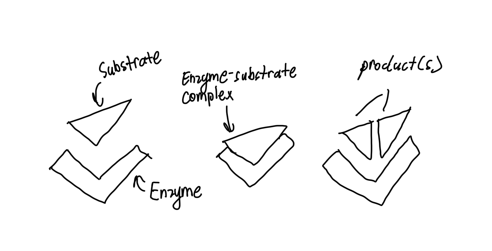
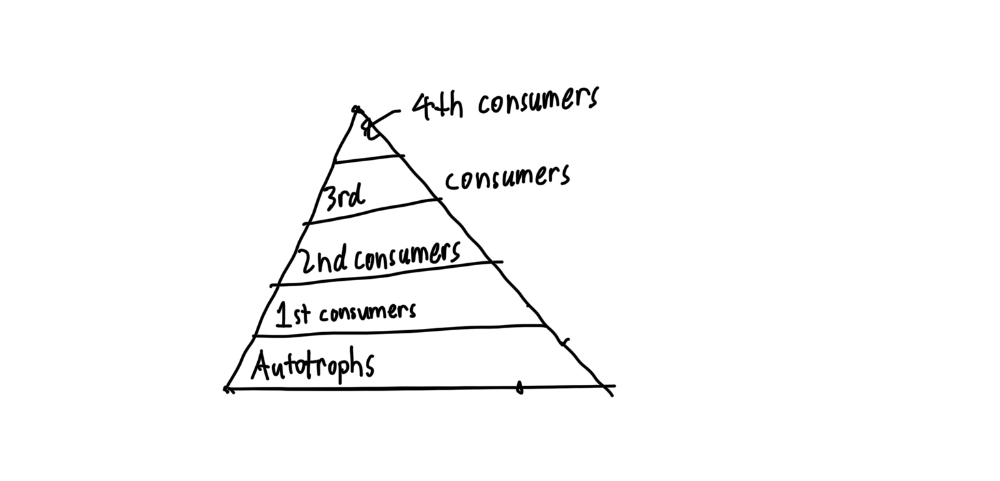
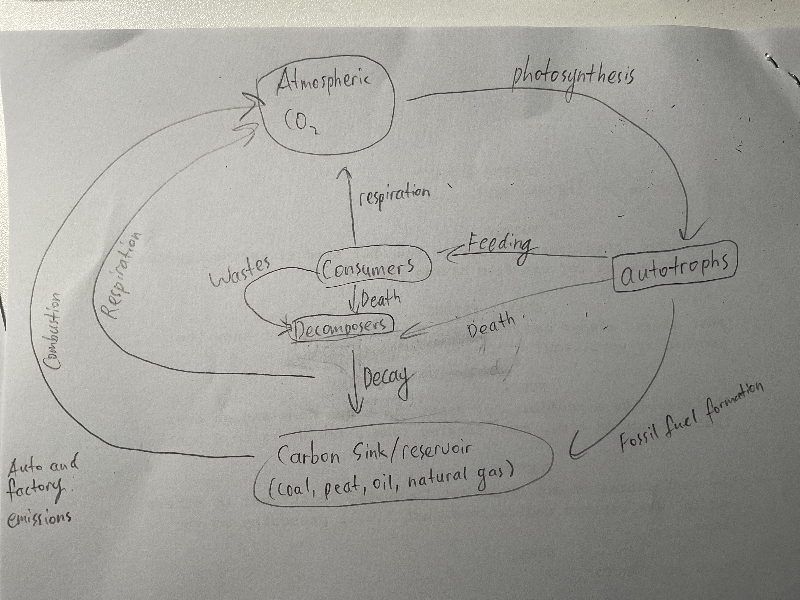
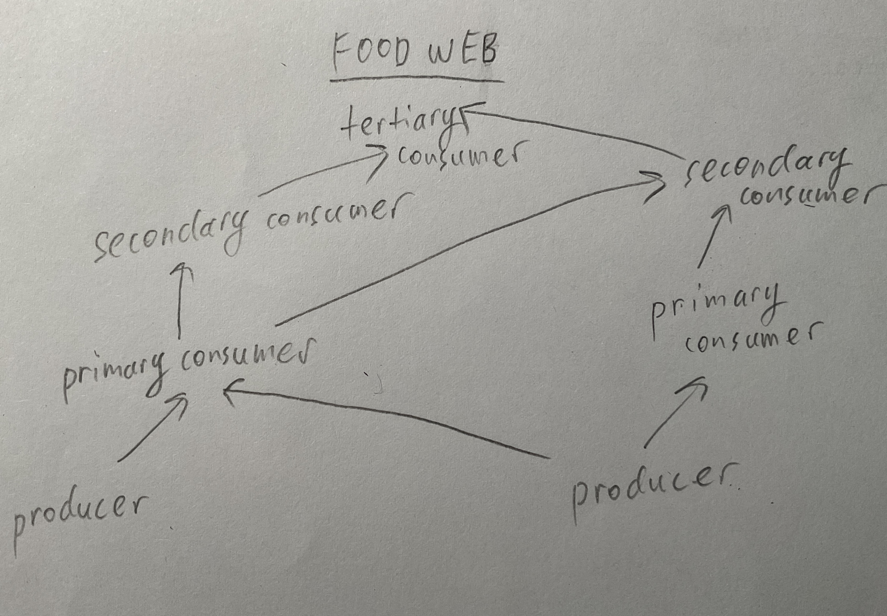
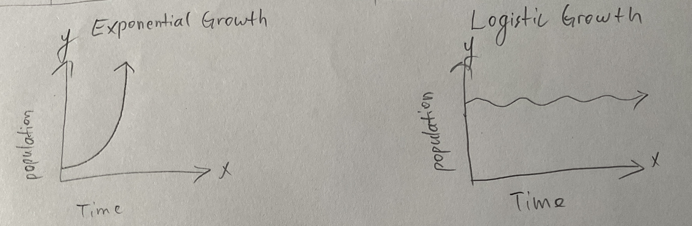

<head>
  <!-- KaTeX CSS -->
  <link rel="stylesheet" href="https://cdn.jsdelivr.net/npm/katex@0.16.9/dist/katex.min.css">

  <!-- KaTeX JS -->
  

  <!-- Auto-render extension -->
  
</head>

# Fall Final Study Guide

## Chapter 1: Investigating Biology

### 1. Characteristics of living things
- maintain homeostasis
- have at least 1 cell
- grow and develop
- reproduce
- respond to stimuli
- evolve
- based on a universal genetic code (DNA)
- metabolize

### 2. The relationship between biodiversity and species

Biodiversity is the variety of organisms, and species is just one type of organism that can mate and produce fertile offspring.

### 3. The importance of homeostasis

Homeostasis is the state of relatively constant internal physical and chemical conditions.

Ex. A body sweating in weather above 37&deg;C

Homeostasis is important because it helps organisms adapt to changes in environment.

### 4. Quantitative and qualitative data

**quantitative data**: Data that can be measured by numbers (Ex. The pool is exactly 5 feet deep.)

**qualitative data**: Data that are not numbers (Ex. This apple is red)

### 5. Graphing

Use the acronym "**TAILS**"

**t**itle

**a**xis

**i**nterval

**l**abels

**s**cale

independent variable $x$: The variable that is changed during an experiment/does not depend on another factor.

dependent variable $y$: The variable that depends on $x$.

### 6. Parts & function of a microscope + magnification

#### Parts & function

Parts | Function
--- | ---
Eyepiece lens | Viewing
Revolving nosepiece | Holds objectives and allows switching
Low power objectives | Low magnification (**40x total**)
Medium power objectives | Medium magnification (**100x total**)
High power objective | High magnification (**400 total**)
Stage clips | Secures slide in place
Diaphram | Controls light intensity
Light | Provides illumination
Arm | Provies structural stability
Stage | Holds slide for viewing
Coarse adjustment knob | Large focus change
Find adjustment knob | Small focus change
Cord | Power
Base | Stability
Slide | Holding specimen
Cover Slip | Protects/secures specimen

#### Magnification

[Magnification of eyepiece (10x)] $\cdot$ [Magnification of nosepiece] = [Total magnification]

### 7. Fact, theory, and hypothesis

[Credible source for further reading](https://ncse.ngo/definitions-fact-theory-and-law-scientific-work)

**fact**: an observation that has been repeatedly confirmed and that is accepted as "true".

**scientific theory**: a well-supported concept that has broad explanatory power.

**hypothesis**: Possible explanation for a set of observations, or possible answers to a scientific question.

### 8. 8 (actually 7) levels of organization (smallest to largest)

1. organism
2. species
3. population
4. community
5. ecosystem
6. biome
7. biosphere

### 9. CER

claim: a statement 
evidence: data to support the claim 
reasoning: links the evidence to the claim.

## Chapter 2: Chemistry of living things

### 1. Water 

#### Structure
H2O

The atoms are bonded by covalent bonds (when atoms share electrons).

#### Bonds

The hydrogen atoms and oxygen atom are bonded by covalent bonds (when atoms share electrons).

#### Properties

Water is **polar** (uneven charge between the atoms).

Water is an excellent **solvent**.

Water has **cohesion** (attraction between same molecules) and **adhesion** (attraction between two chemically different molecules) properties.

*Example of adhesion*: **Capillary Action**

Water has a **high specific heat** (amount of energy needed to heat one gram of water by 1 &deg;C)

Water uses hydrogen bonding to covalent bond (when atoms share electrons): The negatively charged oxygen atom hydrogen bonds to the positive hydrogen atoms.

### 2. Solutions and pH

#### Solutions

**solute**: the matter being dissolved.  
**solvent**: the matter that dissolves.  
**solution**: the result of the process of dissolving.  

#### pH

Ranges from **0 to 14**, and each step represents a factor of **10** (much like an earthquake scale)

higher pH = more basic (OH-)
  lower pH = more acidic (H+)

**strong acids or bases** cause great change in pH (acid or base).

**buffers**: **week acids or bases** that can react with strong acids or bases to prevent sharp, sudden changes in pH. If a sulution contains a buffer, adding an acid will only cause a slight pH change.

word | definition
--- | ---
capillary action | When water goes up thin tubes, leveraging adhesion and cohesion.
mixture |  When two substances are not chemically bonded, and they can still be physically seperated.
solution | When a solvent dissolves a solute.
suspension | Not dissolved, but still seperated by solvent (Ex. sand in water).
buffers | Weak acids or bases that prevent sharp changes in pH.

### 3. Macromolecules

Polymer | Monomer | Function | General Structure | Molecular Structure | Examples
--- | --- | --- | --- | --- | ---
Carbohydrate (Polysacchoride) | Monosacchoride (glucose, other *ose*) | Energy, structure protection | CHO |  | Starch, rice, pasta
Lipid (Triglycerides) | Glycerol & fatty acids | Energy storage, membranes, chemical messengers, Insulation, cushioning, waterproof covers. | CH (long hydrocarbon chains)O |  | Oils, fish, avocado
Proteins (polypeptides) | Amino Acids | Act as enzymes, communication between cells, cellular structures, transport substances, fight disease (Vitamin C). | CHON |  | Meats, beans
Nucleic Acids (Polynucleotides [DNA, RNA]) | Nucleotide (pentose (5-carbon sugar), phosphate group, nitrogenous base) | Stores and transmits genetics | CHONP |  | Strawberry, beef

### 4. The role of enzymes in chemical reactions

Enzymes bind to substrates, breaking or combining them. This speeds up chemical reactions by reducing the activation energy (hence the name "catalysts").

### 5. Enzymatic reactions

### 6. The Lock and Key Model of enzymes

An enzyme's active site (the lock) can only bind to a specific substrate(the key). The substrate is like a key that starts the chemical reaction.

### 7. The effects of various environments on enzymes

**Temperature**: increaseing temperature increases the rate of the reaction (particles move faster).
 **pH**: changes can affect the speed of a reaction.
 **competitive inhibitors**: other foreign substrates compete with substrates that actually binds to the active site.

### 8. When an enzyme is denatured

The active site is deformed and cannot accept substrates caused by **extreme pH changes, temperature, ion strength, and solubility**.

### 9. Chemical components of Oxygen

[The Periodic Table](https://encrypted-tbn0.gstatic.com/images?q=tbn:ANd9GcSLCDuQvSvo8R4T8_Zlpeq-BSY6K5SMnZBUSA&s)

#
 *protons**: 8
*electrons*: 8
*neutrons*: 8

## Chapters 4-7, Ecology

### 1. Biotic and abiotic factors

**biotic factors**: living components in an ecosystem. (Ex. grass, cows)
 **abiotic factors**: nonliving components in an ecosystem. (Ex. rocks, river)

### 2. Biodiversity

Definition: ***The variety of life***

Humans impact the environment by leaving behind harmful traces.
<mark>check</mark>

### 3. Types of organisms

term | definition
--- | ---
producer | an organism that makes and stores food for consumers
consumer | an organism that consumes other living things for energy
primary consumer | a consumer that directly eats plants (*2nd step of trophic level*)
secondary consumer | a consumer that eats other consumers for energy (*3rd step*)
tertiary consumer | a consumer that eats other consumers for energy (*4th step*)
herbivore | a consumer that only eats autotrophs
decomposer | an organism that breaks things down chemically
scavenger | an organism that feeds on dead or decaying matter
detrivore | an organism that breaks things down physically (through digestion)

### 4. Biomass Pyramid

### 5. The rule of 10%

The energy absorbed from a trophic level is only 10% of the energy transferred to the previous trophic level [the rest 90% is lost in heat (to maintain homeostasis)]

### 6. Keystone species

A species that provides structure and stability to an ecosystem.

### 7. Primary vs. secondary succession

Primary succession is succession that initiates from bare rock, and secondary succession is succession that occurs after a natural disaster took place (when there is still a thin layer of soil on the ground)

### 8. Water cycle

### 9. Carbon cycle

### 10. Nitrogen cycle

Bacteria and lightning fixes nitrogen gas, then, promary producers absorb them. It is transferred to heterotrophs and denitrified after they die. 

**Legume plants** have roots that have N-fixing bacteria, giving them an advantage.

**nitrogen fixation**: The process used by certain bacteria of converting nitrogen gas into ammonia.

**denitrification**: The process used by some bacteria that involves obtaining energy by converting nitrates into nitrogen gas.

### 11. Symbiosis

Word | definition
mutualism | symbiosis in which both organisms benefit
commensalism | symbiosis in which one organism benefits, and the other is unaffected
parasitism | symbiosis in which one organism benefits, and the other is harmed
competition | a struggle to obtain resources (usually results in parasitism-like results)

### 12. Food chains and food webs

food chains: diagram showing the energy transfer of organisms (only one arrow points to each organism).
food web: a combination of many food chains.

### 13. Levels of biological organization

w | def
species | a group of similar organisms that can breed and produce fertile offspring
population | an assemblage of the same species in an area
community | an assemblage of different populations that live together in a defined area
ecosystem | all the organisms that live in a place, together with their physical environment
biome | a group of ecosystems that share similar climates and typical organisms

### 14. Energy in an ecosystem

Most of the energy in an ecosystem comes from **the sun** (without it, life cannot be sustained on Earth).

### 15. Limiting factors

*Limiting factors are Factors that control a population.*

**Density-dependent limiting factors**: limiting factors that arise only when population density is high. *Ex. diseases, competition, parasitism, stress from overcrowding, herbivory, and predation.*

**Density-independent limiting factors**: limiting factors that do not operate more strongly when population density is different. *Ex. Natural disasters and environmental extremes*

### 16. Types of population growth

**Exponential growth** (J-curve): When a population has enough resources, reproduction keeps the population growing exponentially.

**Logistic growth** (S-curve): When a population experiences density-dependent limiting factors, making birth rate equal death date.

### 17. Effecs of immigration, emigration, birth, and death rates on a population

If birth rate > death rate, population increases.

If birth rate < death rate, population decreases.

immigration happens when resources are plentiful, increasing population.

emigration happens when there is a limiting resource, decreasing population.

### 18. Changing environmental conditions on populations

If environmental conditions fall above or below tolerance, organisms need more energy for maintaining homeostasis, and they have less energy for growth and reproduction.

## Chapter 8, Cell structure & function

### 1. Cell parts

cell part | function | process involved | consequences to the cell if this cell part is not functioning properly
--- | --- | --- | ---
nucleus | 
ribosome | 
golgi apparatus | 
endoplasmic reticulum | 
cell membrane | 
mitochondria | 
chloroplast | 
vacuole | 
vesicle | 
lysosome | 

### 2. Cell theory

1. All living things contain cells
2. Cells are the basic units of structure and function in living things
3. New cells come from existing cells

### 3. Prokaryotic vs. eukaryotic cells, plant vs. animal cells

prokaryotes only | both | eukaryotes only
--- | --- | ---
no nucleus no ER no lysosomes no golgi apparatus   no vesicle | has cell membrane   has DNA   has ribosomes   has cytoplasm | has nucleus   has vesicle   has golgi apparatus   has ER

plants only | both | animals only
--- | --- | ---
central vacuole cell wall chloroplast does not burst easity under osmotic pressure | cytoskeleton   nucleus   golgi apparatus   ER   vesicle   ribosomes   cell membrane   cytoplasm   DNA   mitochondria   nucleolus   nuclear envelop   lysosomes (*rare in plants*) |   flagella   centriole <bf> contractile vacuole   bursts easily under osmotic pressure

### 4. Cells are small

<mark>____</mark>

### 5. Cells in different concentrations

<mark>pencil</mark>

### 6. Transport through the cell membrane

<mark>pencil</mark>

### 7. The cell membrane

<mark>____</mark>

### 8. Selectively permeable cell membrane

The cell membrane only allows some things to pass through and not others.

### 9. Fluid mosaic cell membrane

There are many different types of molecules on the cell membrane, making it look like a colorful, irregular mosaic picture.

## Chapters 9 & 10, Carbon Cycling & Energy Aquisition
