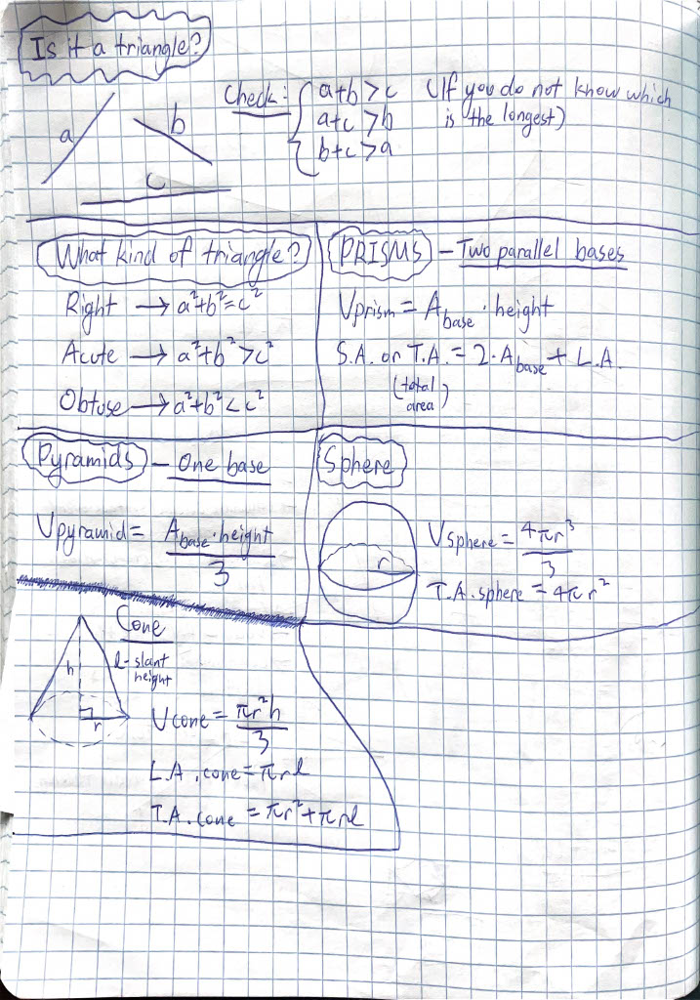

# Study Guide: 3D Shapes & Constructions

**Things to know for the test**:

- Views of 3D solids
- Calculate volume/surface area/lateral area of solids.
- Ratios of sides, areas, volumes problems.
- Vocab —> “fill in the blanks” (SCROLL DOWN TO SEE VOCAB)
- Constructions (how to construct an octagon?)
- Prove pythagorean theorem

**Ratios of similarity:** If a solid is enlarged proportionally by a scale factor of $u$:

New edge length = $u$ $*$ original edge length.

New surface area = $u^2$ $*$ original S.A.

New volume = $u^3$ $*$ original volume.

## 3D Shapes

## Constructions

**You should know all of these constructions**:

1. Construct the perpendicular bisector of a line segment, or construct the midpoint of a line segment.

2. Given a point on a line, construct a perpendicular line through the given point.

3. Given a point not on a line, construct a perpendicular line through the given point.

4. Construct the bisector of an angle.

5. Construct an angle congruent to a given angle.

6. Construct a line through a given point, parallel to a given line.

7. Construct an equilateral triangle, or construct a 60° angle.

8. Construct a regular hexagon.

9. Construct a square, given a line segment.

10. Construct a 30°-60°-90° triangle.

11. Construct a kite.

12. Construct the **centroid** of a triangle.

## Vocabulary

Word | Meaning
--- | ---
median | A segment connecting the vertex of a triangle to the midpoint of the opposite side.
centroid | The point of a triangle that is the intersection of all of its medians.
concurrent | Three or more lines meeting at the same point.
altitude | The height of a triangle.
polyhedron | A closed, 3D solid that has flat, polygonal faces.
polyhedra | Plural of polyhedron.
Prism | A polyhedron with two congruent, parallel bases.
Lateral faces | The faces of the prism without the bases.