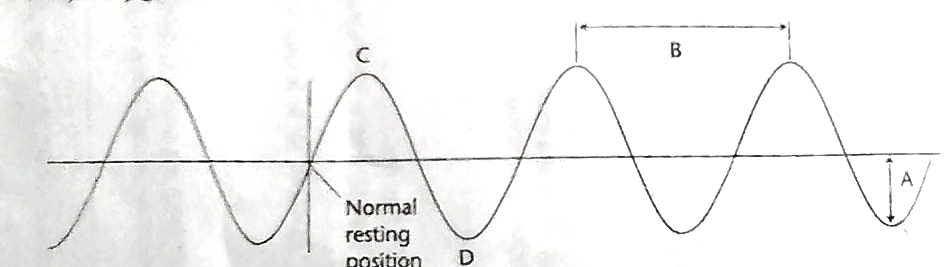

# Test Review for Segment 6, Scope 1 & 2

## Scope 1

 
a. Amplitude
 
b. Wavelength
 
c. Crest
 
d. Trough

1. Crest and trough are peaks and valleys of the wave. Like compression and rarefaction.

2. **Frequency** is how many wavelengths pass in an amount of time.

3. **Wavelength** is the part of a wave that includes two peaks (crest to crest or trough to trough)

4. **Amplitude** is how much the wave differs from the equilibrium.

5. The shorter the wavelength of a wave, the more the frequency.

6. Higher frequency = Higher pitch of sound

7. Higher amplitude = Higher waves

8. Higher amplitude = Higher volume of sound

9. Waves allow energy to be transported without any particle moving teh whole distance.

10. Electromgnetic waves transfer energy through space and medium. Mechanical waves need a medium.

11. v = λ * f

## Scope 2

12. Humans can hear 20 - 20,000 Hz, but dogs can hear >20,000 Hz.

13. Sound waves need a medium to travel.

14. Sound waves travel better with solids than in air.

15. Sound waves go through **reflection**, **absorption**, and **transmission**. ----

16. P-Waves are longitudinal, S-Waves are transverse waves. ----

17. ***Waves' behavior with solids, liquids, and gases***.

18. **Amplitude = A, Wavelength = lambda, Period = T, Frequency = f**

19. T = 1/f

20. v = λ/T (T = Period, f = Frequency, λ = Wavelength)

21. Sound waves travel through mediums.

22. a source creates a wave, not a medium.

23. Transverse waves travel through only solids.

24. Longitudinal waves include only compression and rarefaction.

25. Waves move more quickly through solids.

26. Smooth surfaces reflect sound, while rough surfaces diffuse sound.

27. Sound waves travel at different velocity when they pass through different mediums.

28. Earthquake P-waves (longitudinal), gets refracted by the liquid core, and some whaves are stopped completely.

