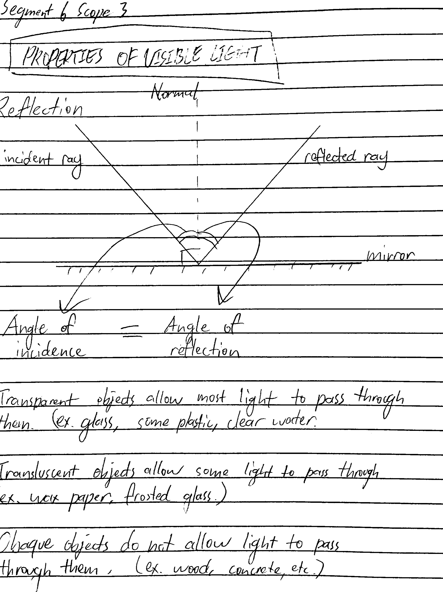
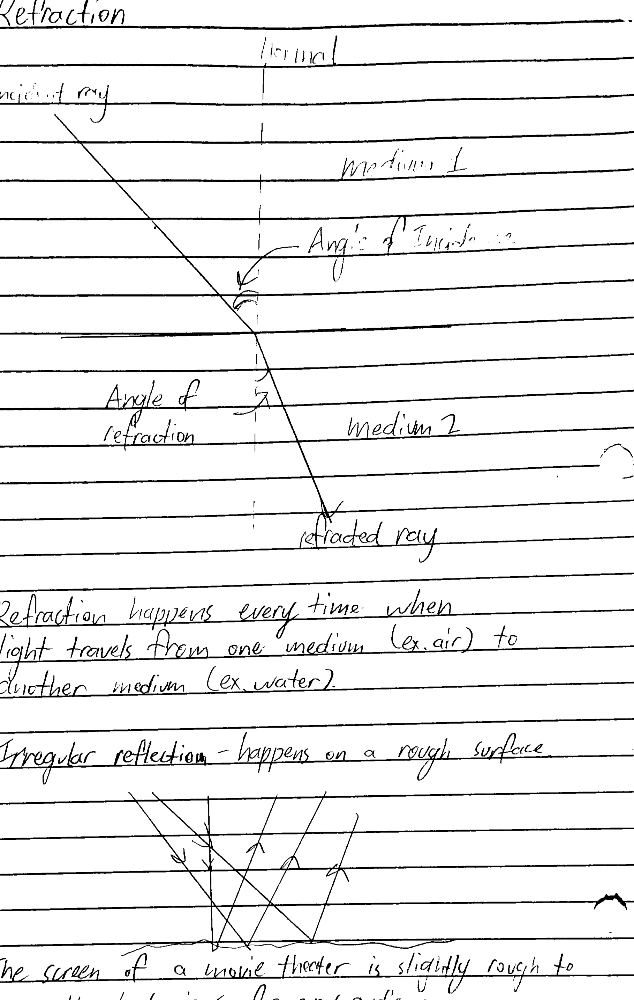

# Segment 6, Scope 3, 4, and 5 Study Guide

[Reading Science A (Scope 3)](Reading_Science_A_Scope_3.pdf)

[Reading Science A (Scope 4)](Reading_Science_A_Scope_4.pdf)

Reading Science A (Scope 5) Not out yet
## Scope 3

### Packet

1. Refraction underwater causes you to see blurry underwater.

2. Light travels in a straight line and can be blocked by objects.

3. When a beam of light hits water, it undergoes **refraction**.

4. Clear Glass is **transparent**.

5. Wood is **opaque**.

6. 
Mechanical Wave | Electromagnetic Wave
--- | ---
Physical energy that needs a medium to travel through | Energy that do not need a medium to travel through
Ex. Sound | Ex. Light
Ex. Ocean | Ex. Heat

7. The denser the medium, the greater the ray refracts [the closer it is to the normal line (vertical line)]

8. 
Color | Frequency | Wavelength | Energy
--- | --- | --- | ---
**Red** | low | long | low
**Violet** | high | short | high

9. Wavelength and frequency have an **inverse relationship**.

10. Light reflects differently with each material.

11. If we can see an object, there is light reflecting off it.

12. A prism **disperses** white light.

13. 

Violet | Red
--- | ---
Hotter, shorter wavelength. | colder, longer wavelength.

14. The higher the temperature, the shorter the wavelength.

15. Blue, Indigo, violet stars have a **shorter wavelength** and are **hotter** than the sun.

16. Orange and red stars have a **longer wavelength** and are colder than the sun.

### Notes

17. **Visible light**: The range of wavelengths of electromagnetic radiation that our eyes can detect.

18. **Spectrum**: The band of colors produced when light is seperated into its component wavelengths.

19. **Transmit**: To pass through a medium.

20. **Refract**: to bend or change direction of a wave.

21. **Reflect**: To bounce back.

22. Visible light is only a small portion of the entire electromagnetic scale.

23. In a vacuum, all electromagnetic waves travel at 300,000,000m/s.

24. Different wavelengths of visible light ranges from 400-700nm.

25. **Dispertion** is the seperation of white color to various colors.

26. When electromagnetic waves encounter different media, they go through **reflection, scattering, refraction, dispersion, absorbtion, diffraction, and transmittion**.

27. Shiny surfaces **reflect** back virtual images, dull surfaces **scatter** light, white **reflects** all light, black **absorbs** all light, red **reflects** only red light.

28. **Absorption** occurs when all or some of the light energy from light waves are transferred from one medium to another.

29. In **reflection**, a wave's direction changes, but speed doesn't change.

30. In **transparent** objects, all light can pass through. In **translucent** objects, some light can pass through. In **opaque** objects, light can't pass through at all.

31. A change of speed causes the wave to bend when it hits a boundary.

32. **Refraction** happens when particles in front slows down and the others are still traveling at the same speed.

33. **Refraction** has many uses, including concave and convex lenses.

34. **Diffraction** is when waves hit a narrow slit and spreads out.

### Reading Science A

35. The ray of light traveling towards the mirrorr is called the **incident** ray.

36. **Convex** mirrors show squashed, right side up, and smaller images. 

37. A **concave** mirror, on the other hand, will make objects tall and thin and can be right-side up or upside down.

38. Side-view mirrors in cars are convex because they always show the image right side up.

39. The rearview mirror in cars are flat because it is used to judge actual distance of traffic behind you.

40. **A still lake** would make a good mirror.

### Concept Attainment Quiz

41. **Visible light waves** is the portion of the electromagetic spectrum that humans can see.

42. Energy waves are **reflected** when bounced off an object.

43. The **electromagnetic spectrum** is all the possible energy levels of electromagnetic radiation.

44. When an energy wave is soaked or taken in, it is **absorbed**.

45. **Transmission** is light passing through an object.

46. The color of an object that humans see is actually the **visible spectrum** of light reflected off the object.

47. Light of different wavelengths looks like different **colors** to humans.

48. The electromagnetic spectrum contains a **wide range** of light waves. Some of the waves are visible to humans and some of them cannot be seen by humans.

49. When a rainbow appears in the sky, it is because light from the **visible spectrum** passed through water vapor and **slowed** down, causing the colors in the visible spectrum to break apart.

50. Light travels in a straight line except at surfaces between different transparent materials (e.g., air and water, air and glass) where the light path bends.

51. The electromagnetic spectrum is all of the electromagnetic wavelengths, including radio waves, x-rays, ultraviolet, infrared, and the visible spectrum. The human eye can only pick up a certain set of wavelengths of light; this is what is known as the visible spectrum. Different wavelengths within the visible spectrum are the different colors we see. The visible spectrum is only a small part of the electromagnetic spectrum.

## Scope 4

### Packet

52.  Sunlight is an electromagnetic wave that does not need a medium to travel through, sound does.

53. As white light gets diffracted by water droplets, a rainbow appears.

54. When an object is seen as a color, it is absorbing all light except that color (reflecting the color).

55. **Visible light** is the area of the electromagnetic wave scale that is visible to the human eye.

56. Higher frequency = less refraction (inverse relationship).

    Light concepts | Explanation with example
    --- | ---
57. **Light waves** | Electromagnetic waves, like light from the sun

58. **Color of light** | Part of the electromagnetic wave spectrum that is visible to the eye (ex. a rainbow).

59. **Brightness of light** | The amplitude of the light wave (ex. putting waxed paper vs. glass in front of a flashlight).

60. **Refraction** | Bending of light (ex. when a pencil is put in water).

61. **Reflection** | Light bouncing off an object (ex. looking into a mirror).

62. **Diffraction** | Light spreading out from one thin source (ex. a small slit in the door lets light into the whole room).

63. Frequency and amplitude are **not related**.

64. The higher the frequency, the shorter the wavelength (**inverse relationship**).

65. Amplitude and energy have **direct relationship**.

66. Wavelength = Speed / Frequency

67. **Reflection** | Light bouncing off an object (ex. looking into a mirror).

68. **Diffraction** | Light spreading out from one thin source (ex. a small slit in the door lets light into the whole room)

69. Frequency and amplitude are **not related**.

70. The higher the frequency, the shorter the wavelength (**inverse relationship**).

71. Amplitude and energy have **direct relationship**.

72. Wavelength = Speed / Frequency

### Notes

73. Electromagnetic waves don't need a medium to travel.

74. The qualities of light includes color and brightness.

75. Refraction is used in corrective lenses to help see more clearly.

76. When light is reflected off a mirror, we can see ourselves.

77. Light can be modeled as **protons** or **waves**.

78. Models of particles or waves can have different uses.

79. If light is not absorbed by an object, it is either reflected or transmitted.

80. Electromagnetic radiations have properties that can be models.

81. **Color**: Specific frequency or wavelength of visible light.

82. **Brightness**: The amplitude or height of a wave measured from the crest to midway between the crest and trough.

### Reading Science A

83. **Both ultraviolet light and microwaves**:
    
    a. Cannot be seen by the human eye.
    
    b. Used by scientists to study the structure of galaxies.

    c. Both are types of radiation emitted by the sun.

84. The best wavelength to use if an astronomer wants to study the composition of planets and stars is **radio waves**.

85. Radio waves:longest wavelength::**gamma rays**:shortest wavelength.

86. **Ultraviolet** light has a wavelength of 10^-8 m.

### Concept Attainment Quiz

87. **Absorption** is the ability to take in light and different waves of energy.

88. **Reflection** is the ability to throw back or bounce back, but not absorb, light and different waves of energy.

89. The **electromagnetic spectrum** is a grouping of all possible energy levels of electromagnetic radiation.

90. **Refraction or scattering** is when an energy wave bends as it passes from object to object.

91. **Transmission** is light passing through an object.

92. A **wave** model of light is useful for explaining brightness.

93. Because light can travel through space, it cannot be a **matter** wave.

94. When light passes through a **medium** like water, it will bend.

95. Black cars **absorb** more light waves than white cars, which causes them to heat up more than white cars.

96. A wave model of light is useful for explaining **brightness, color, and the frequency-dependent bending of light at a surface between media**.

97. As the light passes through the different material (the plastic water bottle and the water in the bottle), the speed of the light carrying the letters to your brain varies, causing the light rays to **refract** (bend at larger angles), effectively making the water bottle an **optical lens** (magnifying glass).

## Scope 5

### Packet

### Notes

### Reading Science A
