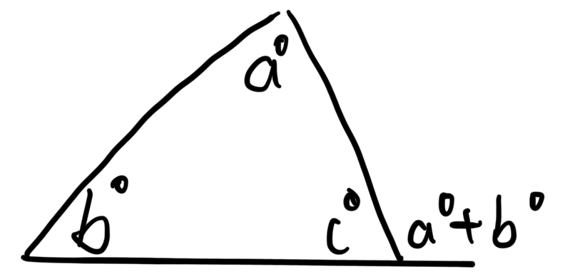

# Polygon Formulas

Polygon | Num of sides | Sum of int. angles | Sum of ext. angles | Num of diagonals
--- | --- | --- | --- | ---
triangle | 3 | 180 | 360 | 0
quatrilateral | 4 | 360 | 360 | 2
pentagon | 5 | 540 | 360 | 5
hexagon | 6 | 720 | 360 | 9
heptagon | 7 | 900 | 360 | 14
octagon | 8 | 1080 | 360 | 20
nonagon | 9 | 1260 | 360 | 27
decagon | 10 | 1440 | 360 | 35
$n$-gon | $n$ | $(n-2)180$ | 360 | $\frac{n(n-3)}{2}$

**Regular Polygons (Equiangluler and Equilateral)**

Measure of one interior angle = $\frac{(n-2)180}{n}$
# Polygon Names

# List of Polygon Names

Here’s a list of polygon names based on the number of sides:  

| **Number of Sides** | **Polygon Name** |
|------------------|----------------|
| 3  | Triangle |
| 4  | Quadrilateral |
| 5  | Pentagon |
| 6  | Hexagon |
| 7  | Heptagon |
| 8  | Octagon |
| 9  | Nonagon |
| 10 | Decagon |
| 11 | Hendecagon (or Undecagon) |
| 12 | Dodecagon |
| 13 | Tridecagon |
| 14 | Tetradecagon |
| 15 | Pentadecagon |
| 16 | Hexadecagon |
| 17 | Heptadecagon |
| 18 | Octadecagon |
| 19 | Enneadecagon (or Nonadecagon) |
| 20 | Icosagon |
| 30 | Triacontagon |
| 40 | Tetracontagon |
| 50 | Pentacontagon |
| 60 | Hexacontagon |
| 70 | Heptacontagon |
| 80 | Octacontagon |
| 90 | Enneacontagon |
| 100 | Hectogon (or Centagon) |
| 1,000 | Chiliagon |
| 10,000 | Myriagon |
| $n$ | $n$-gon |

For larger numbers, you can use **\(n\)-gon** notation, like a **17-gon** for a 17-sided polygon.
# Ratios of Areas ([GeoEC Answer Key](https://classroom.google.com/c/NzAzOTgxNjIwNDU2/m/NzU1NDM1MjIyNTY2/details))
Triangles with the same height will have their area ratio be the ratio of their bases.

If two figures are similar, then the ratio of their areas equals the square of the ratio of corresponding segments.

[Proving that the quad. formed by connecting midpoints of another quad. has an area that is half the bigger quad.](PROVING.pdf)

# Misc. 

# Mini Quiz

1. What is the sum of the interior angles of a hexagon?

    a) 540°

    b) 720°

    c) 900°

    d) 1080°

2. If a polygon has 9 sides, how many diagonals does it have?

    a) 14

    b) 20

    c) 27

    d) 35

3. True or False: The sum of the exterior angles of a decagon is 1440°.

4. What is the formula to calculate the sum of the interior angles of an n-sided polygon?

5. How many diagonals does a pentagon have?

    a) 3

    b) 5

    c) 7

    d) 9

6. Fill in the blank: A quadrilateral has _____ diagonals.

7. If a polygon has an interior angle sum of 1260°, how many sides does it have?

8. What is the sum of the exterior angles of any polygon, regardless of the number of sides?

9. If a polygon has 10 sides, how many diagonals does it have?

10. What is the formula for finding the number of diagonals in an  n -sided polygon?

[Answer Key](anskey.html)